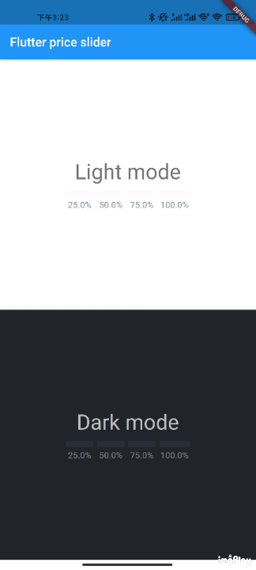

# flutter_price_slider

A component that provides price slider just like binance. It could be used for select percentage of price.

## Demo

You can try it on the demo site

https://wingch.github.io/flutter_price_slider/



## How to use

```dart 
import 'package:flutter_price_slider/flutter_price_slider.dart';
```

```dart
FlutterPriceSlider(
  width: 200,
  selectedBoxColor: Color(0xFF2ebd85),
  unselectedBoxColor: Color(0xFFf9f9f9),
  selectedTextColor: Color(0xFF000000),
  unselectedTextColor: Color(0XFF7d8896),
  onSelected: (proportion) {
    print("onSelected: $proportion");
  },
),
```

## Features and bugs

Please file feature requests and bugs at the [issue tracker](https://github.com/WingCH/flutter_price_slider/issues).

